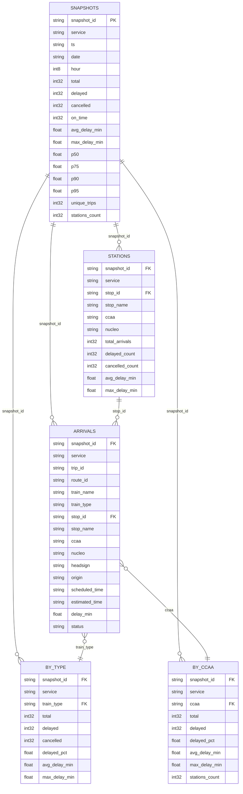

# data/

Almacenamiento columnar histórico del pipeline de Renfe Enhora.

Cada ejecución del pipeline (`python -m scripts.main`) añade filas a estos ficheros Parquet sin borrar datos anteriores. Son la **fuente de verdad histórica** del proyecto.

Los JSONs en `public/data/` son artefactos generados a partir de estos datos para servir al frontend estático de Vercel. No son la fuente de verdad.

## Tablas

| Carpeta | Estructura | Grain | Tamaño estimado |
|---------|-----------|-------|-----------------|
| `snapshots/` | `snapshots.parquet` | 1 fila por ejecución | < 1 MB/año |
| `arrivals/` | `YYYY-MM-DD/{snapshot_id}.parquet` | 1 fila por tren × estación × ejecución | ~5-12 MB/día |
| `stations/` | `YYYY-MM-DD/{snapshot_id}.parquet` | 1 fila por estación × ejecución | ~1-3 MB/día |
| `by_type/` | `history.parquet` | 1 fila por tipo de tren × ejecución | < 1 MB/año |
| `by_ccaa/` | `history.parquet` | 1 fila por CCAA × ejecución | < 1 MB/año |

## Relaciones entre tablas



> `SNAPSHOTS` es la tabla raíz: cada ejecución del pipeline genera un `snapshot_id` del que cuelgan todas las demás. `ARRIVALS` es la tabla de mayor granularidad (tren × estación × snapshot); `STATIONS`, `BY_TYPE` y `BY_CCAA` son agregaciones precalculadas del mismo snapshot.

## Cómo leer

```python
import pyarrow.parquet as pq
import pandas as pd
import glob

# Un snapshot concreto
df = pd.read_parquet("data/arrivals/2026-04-10/cercanias_2026-04-10T08-19.parquet")

# Todo un día
df = pq.ParquetDataset("data/arrivals/2026-04-10/").read().to_pandas()

# Varios días (arrivals o stations)
df = pd.concat([
    pd.read_parquet(f)
    for f in sorted(glob.glob("data/arrivals/2026-04-*/*.parquet"))
])
```

## Cómo se generan

El módulo `scripts/output/parquet_writer.py` expone `append_snapshot()`, que es llamado desde `scripts/main.py` al final de cada ejecución del pipeline.

## Compresión

Los ficheros usan compresión **zstd** internamente (gestionada por pyarrow). No es necesario comprimir manualmente.

## Consultas por fecha y hora exacta

El pipeline corre cada 5 minutos. Cada ejecución escribe un `snapshot_id` con formato `{service}_{YYYY-MM-DDTHH:MM}` y un campo `ts` (timestamp UTC). Esto permite reconstruir el estado del sistema en cualquier ventana de 5 minutos.

```python
import pyarrow.parquet as pq
import pandas as pd

# Estado global en un instante concreto
snapshots = pd.read_parquet("data/snapshots/snapshots.parquet")
estado = snapshots[snapshots.snapshot_id == "cercanias_2026-04-15T08:30"]

# Trenes retrasados el 15 de abril entre 08:25 y 08:35
arrivals = pq.ParquetDataset("data/arrivals/2026-04-15/").read().to_pandas()
ventana = arrivals[
    arrivals.snapshot_id.between("cercanias_2026-04-15T08:25", "cercanias_2026-04-15T08:35")
]
```

**Nota sobre los arrivals:** cada snapshot contiene los trenes previstos en los próximos 60 minutos desde ese instante. Un tren que pasó a las 08:15 aparece en snapshots de 07:15–08:15, no en el de 08:30. Para reconstruir "qué trenes estaban activos exactamente a las 08:30" usa el snapshot inmediatamente anterior a esa hora.

**Granularidad:** 5 minutos. Los datos están disponibles desde la primera ejecución del pipeline en producción.
